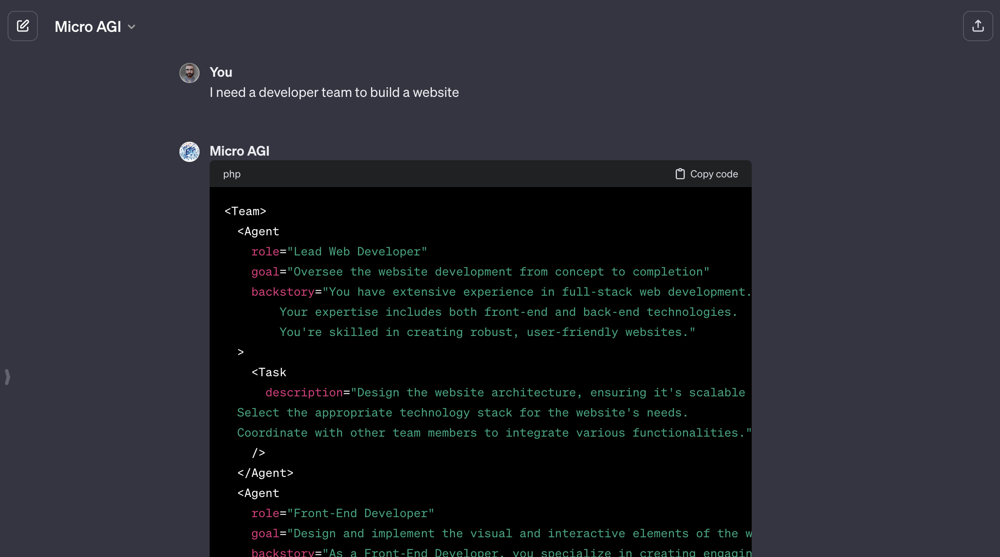

# micro-agi: A React-Based Framework for AI Autonomous Agents

```jsx
<Team>
  <Agent role="designer">
    <Task description="design landing page" />
  </Agent>
  <Agent role="frontend developer">
    <Task description="develop landing page with react and tailwind" />
    <Task description="publish to github" />
  </Agent>
</Team>
```

- [Introduction](#introduction)
- [What is micro-agi?](https://github.com/microchipgnu/micro-agi/wiki/What-is-micro%E2%80%90agi%3F)
- [How It Works](#how-it-works)
- [Features](#features)
- [Examples](#examples)
- [The Why](#the-why)
- [🔗 Chat with a 🤖 GPT to create your first Team](https://chat.openai.com/g/g-KSdm64VWE-micro-agi)

## Introduction

Welcome to `micro-agi`, an innovative React-based framework designed for building and orchestrating role-player, AI autonomous agents. This project, inspired by the vast potential of the JavaScript ecosystem, provides a unique approach to managing AI agents in both browser and server-based applications.

## How It Works

Using `micro-agi`, you can create complex systems of AI agents that work together to accomplish tasks. Here's a simple example

```jsx
<Team>
  <Agent role="designer">
    <Task description="design landing page" />
  </Agent>
  <Agent role="frontend developer">
    <Task description="develop landing page with react and tailwind" />
    <Task description="publish to github" />
  </Agent>
</Team>
```

In this example, the [Team](#team) contains two [Agent](#agent) components: one with the role of a designer and the other as a frontend developer. Each agent has specific [Task](#task) components assigned to them, and these tasks can be enhanced with tools compatible with Langchain for advanced language processing capabilities.

## Features

- Role-Based Agent Design: Customize agents with specific roles, goals, and tools.
- Autonomous Inter-Agent Delegation: Agents can autonomously delegate tasks and inquire amongst themselves, enhancing problem-solving efficiency.
- Flexible Task Management: Define tasks with customizable tools and assign them to agents dynamically.
- Processes Driven: Currently only supports sequential task execution but more complex processes like consensual and hierarchical being worked on.
- React-based framework: Taps into the whole React ecosystem
- Suitable for browser and server-based apps
  - See [App](./packages/app/) example
  - See [CLI](./packages/cli/) example

## Examples

Coming soon...

## [Create your first team with ChatGPT](https://chat.openai.com/g/g-KSdm64VWE-micro-agi)

Link: [https://chat.openai.com/g/g-KSdm64VWE-micro-agi](https://chat.openai.com/g/g-KSdm64VWE-micro-agi)



## The Why

Back in December 2023 I started exploring the different options to build, orchestrate and run AI autonomous agents and I found several options like AutoGPT, baby-agi, smol-dev and a few others. I got frustrated with the lack of projects that would tap in the vast JS ecosystem (browser and node). I started running a few experiments -- that can be found in the branch [deprecated](https://github.com/microchipgnu/micro-agi/tree/deprecated).

Now (January 2024), I got inspired by [CrewAI](https://github.com/joaomdmoura/crewAI) approach. I felt that I could try to replicate some of its functionality into the ideas I had spinning in my head over the holidays, more specifically having a JSX-style to declaritively express teams and then having teams that can tap

```
 ███╗   ███╗ ██╗  ██████╗ ██████╗   ██████╗       █████╗   ██████╗  ██╗
 ████╗ ████║ ██║ ██╔════╝ ██╔══██╗ ██╔═══██╗     ██╔══██╗ ██╔════╝  ██║
 ██╔████╔██║ ██║ ██║      ██████╔╝ ██║   ██║     ███████║ ██║  ███╗ ██║
 ██║╚██╔╝██║ ██║ ██║      ██╔══██╗ ██║   ██║     ██╔══██║ ██║   ██║ ██║
 ██║ ╚═╝ ██║ ██║ ╚██████╗ ██║  ██║ ╚██████╔╝     ██║  ██║ ╚██████╔╝ ██║
 ╚═╝     ╚═╝ ╚═╝  ╚═════╝ ╚═╝  ╚═╝  ╚═════╝      ╚═╝  ╚═╝  ╚═════╝  ╚═╝
```
