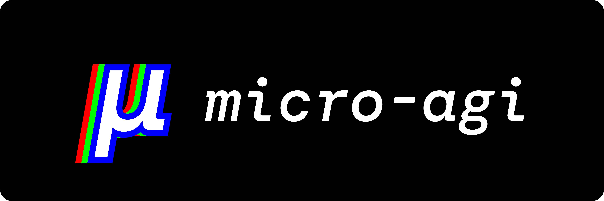

---

Welcome to `micro-agi`, an innovative React-based framework designed for building and orchestrating role-player, AI autonomous agents.

This project, inspired by the vast potential of the JavaScript ecosystem, provides a unique approach to managing AI agents in both browser and server-based applications.

With `micro-agi`, you can create complex systems of AI agents that work together to accomplish tasks. Here's a simple example

```jsx
<Team>
  <Agent role="designer">
    <Task>Design landing page</Task>
  </Agent>
  <Agent role="frontend developer">
    <Task>Develop landing page with React and Tailwind</Task>
    <Task>Publish to GitHub</Task>
  </Agent>
</Team>
```

## Getting Started

Read the [documentation](https://agi.microchipgnu.pt).

### Prerequisites

Before you begin, ensure you have the following installed:

1. Node.js (LTS version)
2. A package manager like npm, pnpm or Bun
3. Basic understanding of React and JSX

### Installation

To get started with `micro-agi`, you need to install the package in your React project.

micro-agi works seamlessly with [AI.JSX](https://docs.ai-jsx.com), a framework for building AI applications using JavaScript and JSX. To take full advantage of micro-agi, make sure you have [AI.JSX](https://docs.ai-jsx.com) installed in your project.

If you're using Bun as your package manager, run the following command:

```sh
bun add micro-agi
```

For npm users, use:

```sh
npm install micro-agi
```

For pnpm users, use:

```sh
pnpm install micro-agi
```

### Your first AI Team

With `micro-agi`, you can create a team of AI agents, each with specific roles and tasks. 

Here's a simple example to get you started:

```jsx
/** @jsxImportSource ai-jsx */
import * as AI from "ai-jsx";
import Agent from "micro-agi/core/components/agent";
import Task from "micro-agi/core/components/task";
import Team from "micro-agi/core/components/team";

const App = async ({ topic }: { topic: string }) => {
  return (
    <Team process="sequential">
      <Agent
        agentType="mrkl"
        role="Writer"
        goal="Write articles about a topic"
        backstory="You are a very experienced writer. You've written thousands of article in your career."
        model="mistral"
        provider="ollama"
      >
        <Task
          onStart={async () => {
            console.log("Started writing article about", topic);
          }}
          onDone={async () => {
            console.log("Done writing article about", topic);
          }}
        >
          Write an article about {topic}. Your result in markdown format.
        </Task>
      </Agent>
    </Team>
  );
};

const renderContext = AI.createRenderContext();
const result = await renderContext.render(<App topic="Apple" />);
await Bun.write(`./result.json`, result);
```

This is taken from [micro-agi-starter](https://github.com/microchipgnu/micro-agi-starter/tree/main) repo. Feel free to clone and run it locally against Ollama.